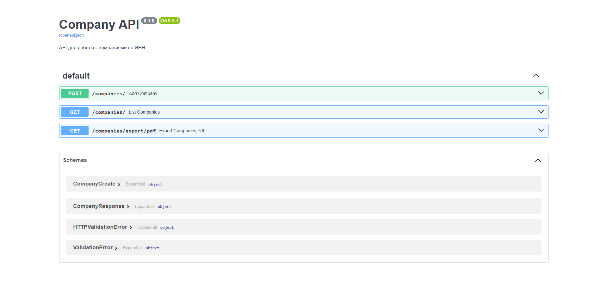

# Company API

API для получения данных о компаниях по ИНН с экспортом в PDF.

---

## Описание

Сервис принимает ИНН компаний, сохраняет данные в базу и позволяет:
- Просматривать список компаний
- Фильтровать по ИНН и имени
- Экспортировать в PDF

Используется FastAPI, SQLAlchemy и ReportLab.

---

## Запуск

bash
1. Клонировать
git clone https://github.com/daniillopatin245-gif/company-api.git
cd company-api

2. Виртуальное окружение
python -m venv venv
venv\Scripts\activate

3. Установка
pip install -r requirements.txt

4. Запуск
uvicorn main:app --reload

Открыть: http://localhost:8000/docs

# Скриншоты
## Swagger UI

Автор
daniillopatin245-gif